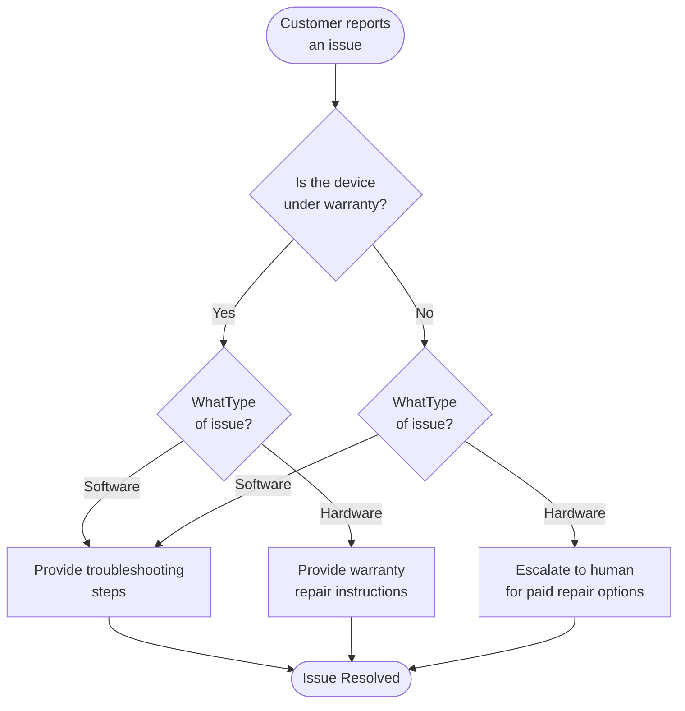

# Build customer support with handoffs

The [state machine pattern](/oss/python/langchain/multi-agent/handoffs) describes workflows where an agent's behavior changes as it moves through different states of a task. This tutorial shows how to implement a state machine by using tool calls to dynamically change a single agent's configuration—updating its available tools and instructions based on the current state.

In this tutorial, you'll build a customer support agent that does the following:

- Collects warranty information before proceeding.
- Classifies issues as hardware or software.
- Provides solutions or escalates to human support.
- Maintains conversation state across multiple turns.

Here's the workflow we'll build:



## Setup

This tutorial requires the `langchain` package:

```bash
pip install langchain
```

For more details, see our [Installation guide](/oss/python/langchain/install).

## 1. Define custom state

First, define a custom state schema that tracks which step is currently active:

```python
from langchain.agents import AgentState
from typing_extensions import NotRequired
from typing import Literal

SupportStep = Literal["warranty_collector", "issue_classifier", "resolution_specialist"]

class SupportState(AgentState):
    """State for customer support workflow."""
    current_step: NotRequired[SupportStep]
    warranty_status: NotRequired[Literal["in_warranty", "out_of_warranty"]]
    issue_type: NotRequired[Literal["hardware", "software"]]
```

## 2. Create tools that manage workflow state

Create tools that update the workflow state:

```python
from langchain.tools import tool, ToolRuntime
from langchain.messages import ToolMessage
from langgraph.types import Command

@tool
def record_warranty_status(
    status: Literal["in_warranty", "out_of_warranty"],
    runtime: ToolRuntime[None, SupportState],
) -> Command:
    """Record the customer's warranty status and transition to issue classification."""
    return Command(
        update={
            "messages": [
                ToolMessage(
                    content=f"Warranty status recorded as: {status}",
                    tool_call_id=runtime.tool_call_id,
                )
            ],
            "warranty_status": status,
            "current_step": "issue_classifier",
        }
    )


@tool
def record_issue_type(
    issue_type: Literal["hardware", "software"],
    runtime: ToolRuntime[None, SupportState],
) -> Command:
    """Record the type of issue and transition to resolution specialist."""
    return Command(
        update={
            "messages": [
                ToolMessage(
                    content=f"Issue type recorded as: {issue_type}",
                    tool_call_id=runtime.tool_call_id,
                )
            ],
            "issue_type": issue_type,
            "current_step": "resolution_specialist",
        }
    )


@tool
def escalate_to_human(reason: str) -> str:
    """Escalate the case to a human support specialist."""
    return f"Escalating to human support. Reason: {reason}"


@tool
def provide_solution(solution: str) -> str:
    """Provide a solution to the customer's issue."""
    return f"Solution provided: {solution}"
```

## 3. Define step configurations

Map step names to their configurations using a dictionary:

```python
STEP_CONFIG = {
    "warranty_collector": {
        "prompt": "You are a customer support agent... At this step, ask if their device is under warranty...",
        "tools": [record_warranty_status],
        "requires": [],
    },
    "issue_classifier": {
        "prompt": "You are a customer support agent... CURRENT STAGE: Issue classification. CUSTOMER INFO: Warranty status is {warranty_status}...",
        "tools": [record_issue_type],
        "requires": ["warranty_status"],
    },
    "resolution_specialist": {
        "prompt": "You are a customer support agent... CURRENT STAGE: Resolution. CUSTOMER INFO: Warranty status is {warranty_status}, issue type is {issue_type}...",
        "tools": [provide_solution, escalate_to_human],
        "requires": ["warranty_status", "issue_type"],
    },
}
```

## 4. Create step-based middleware

```python
from langchain.agents.middleware import wrap_model_call, ModelRequest, ModelResponse
from typing import Callable


@wrap_model_call
def apply_step_config(
    request: ModelRequest,
    handler: Callable[[ModelRequest], ModelResponse],
) -> ModelResponse:
    """Configure agent behavior based on the current step."""
    current_step = request.state.get("current_step", "warranty_collector")
    stage_config = STEP_CONFIG[current_step]

    for key in stage_config["requires"]:
        if request.state.get(key) is None:
            raise ValueError(f"{key} must be set before reaching {current_step}")

    system_prompt = stage_config["prompt"].format(**request.state)
    request = request.override(
        system_prompt=system_prompt,
        tools=stage_config["tools"],
    )
    return handler(request)
```

## 5. Create the agent

```python
from langchain.agents import create_agent
from langgraph.checkpoint.memory import InMemorySaver

all_tools = [
    record_warranty_status,
    record_issue_type,
    provide_solution,
    escalate_to_human,
]

agent = create_agent(
    model,
    tools=all_tools,
    state_schema=SupportState,
    middleware=[apply_step_config],
    checkpointer=InMemorySaver(),
)
```

<Note>
  **Why a checkpointer?** The checkpointer maintains state across conversation turns. Without it, the `current_step` state would be lost between user messages, breaking the workflow.
</Note>

## 6. Test the workflow

```python
from langchain.messages import HumanMessage
from langchain_core.utils.uuid import uuid7

thread_id = str(uuid7())
config = {"configurable": {"thread_id": thread_id}}

result = agent.invoke(
    {"messages": [HumanMessage("Hi, my phone screen is cracked")]},
    config
)
result = agent.invoke(
    {"messages": [HumanMessage("Yes, it's still under warranty")]},
    config
)
result = agent.invoke(
    {"messages": [HumanMessage("The screen is physically cracked from dropping it")]},
    config
)
result = agent.invoke(
    {"messages": [HumanMessage("What should I do?")]},
    config
)
```

Expected flow:

1. **Warranty verification step**: Asks about warranty status
2. **Issue classification step**: Asks about the problem, determines it's hardware
3. **Resolution step**: Provides warranty repair instructions

## 7. Manage message history

Use [summarization middleware](/oss/python/langchain/short-term-memory#summarize-messages) to compress earlier messages:

```python
from langchain.agents.middleware import SummarizationMiddleware

agent = create_agent(
    model,
    tools=all_tools,
    state_schema=SupportState,
    middleware=[
        apply_step_config,
        SummarizationMiddleware(
            model="gpt-5.4-mini",
            trigger=("tokens", 4000),
            keep=("messages", 10)
        )
    ],
    checkpointer=InMemorySaver(),
)
```

## 8. Add flexibility: Go back

Add tools to allow users to return to previous steps:

```python
@tool
def go_back_to_warranty() -> Command:
    """Go back to warranty verification step."""
    return Command(update={"current_step": "warranty_collector"})


@tool
def go_back_to_classification() -> Command:
    """Go back to issue classification step."""
    return Command(update={"current_step": "issue_classifier"})
```

## Next steps

- Learn about the [subagents pattern](/oss/python/langchain/multi-agent/subagents-personal-assistant)
- Explore [middleware](/oss/python/langchain/middleware)
- Read the [multi-agent overview](/oss/python/langchain/multi-agent)

***

<div className="source-links">
  <Callout icon="terminal-2">
    [Connect these docs](/use-these-docs) to Claude, VSCode, and more via MCP for real-time answers.
  </Callout>

  <Callout icon="edit">
    [Edit this page on GitHub](https://github.com/langchain-ai/docs/edit/main/src/oss/langchain/multi-agent/handoffs-customer-support.mdx) or [file an issue](https://github.com/langchain-ai/docs/issues/new/choose).
  </Callout>
</div>