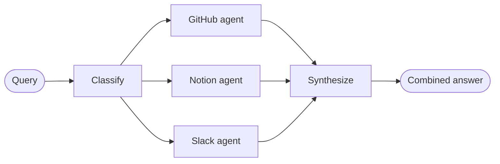

# Build a multi-source knowledge base with routing

The **router pattern** is a [multi-agent](/oss/python/langchain/multi-agent) architecture where a routing step classifies input and directs it to specialized agents, with results synthesized into a combined response. This pattern excels when your organization's knowledge lives across distinct **verticals**.

In this tutorial, you'll build a multi-source knowledge base router that coordinates three specialists:

- A **GitHub agent** that searches code, issues, and pull requests.
- A **Notion agent** that searches internal documentation and wikis.
- A **Slack agent** that searches relevant threads and discussions.

When a user asks "How do I I authenticate API requests?", the router decomposes the query into source-specific sub-questions, routes them to the relevant agents in parallel, and synthesizes results into a coherent answer.



### Why use a router?

- **Parallel execution**: Query multiple sources simultaneously
- **Specialized agents**: Each vertical has focused tools and prompts optimized for its domain
- **Selective routing**: Not every query needs every source—the router intelligently selects relevant verticals
- **Targeted sub-questions**: Each agent receives a question tailored to its domain
- **Clean synthesis**: Results from multiple sources are combined into a single, coherent response

## Setup

This tutorial requires the `langchain` and `langgraph` packages:

```bash
pip install langchain langgraph
```

For more details, see our [Installation guide](/oss/python/langchain/install).

## 1. Define state

```python
from typing import Annotated, Literal, TypedDict
import operator


class AgentInput(TypedDict):
    """Simple input state for each subagent."""
    query: str


class AgentOutput(TypedDict):
    """Output from each subagent."""
    source: str
    result: str


class Classification(TypedDict):
    """A single routing decision: which agent to call with what query."""
    source: Literal["github", "notion", "slack"]
    query: str


class RouterState(TypedDict):
    query: str
    classifications: list[Classification]
    results: Annotated[list[AgentOutput], operator.add]  # Reducer collects parallel results
    final_answer: str
```

## 2. Define tools for each vertical

```python
from langchain.tools import tool


@tool
def search_code(query: str, repo: str = "main") -> str:
    """Search code in GitHub repositories."""
    return f"Found code matching '{query}' in {repo}"


@tool
def search_issues(query: str) -> str:
    """Search GitHub issues and pull requests."""
    return f"Found 3 issues matching '{query}'"


@tool
def search_prs(query: str) -> str:
    """Search pull requests for implementation details."""
    return f"PR details for '{query}'"


@tool
def search_notion(query: str) -> str:
    """Search Notion workspace for documentation."""
    return f"Found documentation matching '{query}'"


@tool
def get_page(page_id: str) -> str:
    """Get a specific Notion page by ID."""
    return f"Page content for {page_id}"


@tool
def search_slack(query: str) -> str:
    """Search Slack messages and threads."""
    return f"Found discussion matching '{query}'"


@tool
def get_thread(thread_id: str) -> str:
    """Get a specific Slack thread."""
    return f"Thread content for {thread_id}"
```

## 3. Create specialized agents

```python
from langchain.agents import create_agent
from langchain.chat_models import init_chat_model

model = init_chat_model("openai:gpt-5.5")

github_agent = create_agent(
    model,
    tools=[search_code, search_issues, search_prs],
    system_prompt=(
        "You are a GitHub expert. Answer questions about code, "
        "API references, and implementation details by searching "
        "repositories, issues, and pull requests."
    ),
)

notion_agent = create_agent(
    model,
    tools=[search_notion, get_page],
    system_prompt=(
        "You are a Notion expert. Answer questions about internal "
        "processes, policies, and team documentation."
    ),
)

slack_agent = create_agent(
    model,
    tools=[search_slack, get_thread],
    system_prompt=(
        "You are a Slack expert. Answer questions by searching "
        "relevant threads and discussions."
    ),
)
```

## 4. Build the router workflow

```python
from pydantic import BaseModel, Field
from langgraph.graph import StateGraph, START, END
from langgraph.types import Send

router_llm = init_chat_model("openai:gpt-5.4-mini")


class ClassificationResult(BaseModel):
    """Result of classifying a user query into agent-specific sub-questions."""
    classifications: list[Classification] = Field(
        description="List of agents to invoke with their targeted sub-questions"
    )


def classify_query(state: RouterState) -> dict:
    """Classify query and determine which agents to invoke."""
    structured_llm = router_llm.with_structured_output(ClassificationResult)

    result = structured_llm.invoke([
        {
            "role": "system",
            "content": """Analyze this query and determine which knowledge bases to consult.
For each relevant source, generate a targeted sub-question optimized for that source.

Available sources:
- github: Code, API references, implementation details, issues, pull requests
- notion: Internal documentation, processes, policies, team wikis
- slack: Team discussions,, informal knowledge sharing, recent conversations

Return ONLY the sources that are relevant to the query."""
        },
        {"role": "user", "content": state["query"]}
    ])

    return {"classifications": result.classifications}


def route_to_agents(state: RouterState) -> list[Send]:
    """Fan out to agents based on classifications."""
    return [
        Send(c["source"], {"query": c["query"]})
        for c in state["classifications"]
    ]


def query_github(state: AgentInput) -> dict:
    """Query the GitHub agent."""
    result = github_agent.invoke({
        "messages": [{"role": "user", "content": state["query"]}]
    })
    return {"results": [{"source": "github", "result": result["messages"][-1].content}]}


def query_notion(state: AgentInput) -> dict:
    """Query the Notion agent."""
    result = notion_agent.invoke({
        "messages": [{"role": "user", "content": state["query"]}]
    })
    return {"results": [{"source": "notion", "result": result["messages"][-1].content}]}


def query_slack(state: AgentInput) -> dict:
    """Query the Slack agent."""
    result = slack_agent.invoke({
        "messages": [{"role": "user", "content": state["query"]}]
    })
    return {"results": [{"source": "slack", "result": result["messages"][-1].content}]}


def synthesize_results(state: RouterState) -> dict:
    """Combine results from all agents into a coherent answer."""
    if not state["results"]:
        return {"final_answer": "No results found from any knowledge source."}

    formatted = [
        f"**From {r['source'].title()}:**\n{r['result']}"
        for r in state["results"]
    ]

    synthesis_response = router_llm.invoke([
        {
            "role": "system",
            "content": f"""Synthesize these search results to answer the original question: "{state['query']}"""
        },
        {"role": "user", "content": "\n\n".join(formatted)}
    ])

    return {"final_answer": synthesis_response.content}
```

## 5. Compile the workflow

```python
workflow = (
    StateGraph(RouterState)
    .add_node("classify", classify_query)
    .add_node("github", query_github)
    .add_node("notion", query_notion)
    .add_node("slack", query_slack)
    .add_node("synthesize", synthesize_results)
    .add_edge(START, "classify")
    .add_conditional_edges("classify", route_to_agents, ["github", "notion", "slack"])
    .add_edge("github", "synthesize")
    .add_edge("notion", "synthesize")
    .add_edge("slack", "synthesize")
    .add_edge("synthesize", END)
    .compile()
)
```

## 6. Use the router

```python
result = workflow.invoke({
    "query": "How do I authenticate API requests?"
})

print("Original query:", result["query"])
print("\nClassifications:")
for c in result["classifications"]:
    print(f"  {c['source']}: {c['query']}")
print("\n" + "=" * 60 + "\n")
print("Final Answer:")
print(result["final_answer"])
```

## 7. Stateful routers with tool wrapper

For multi-turn conversations, wrap the stateless router as a tool:

```python
from langgraph.checkpoint.memory import InMemorySaver


@tool
def search_knowledge_base(query: str) -> str:
    """Search across multiple knowledge sources (GitHub, Notion, Slack)."""
    result = workflow.invoke({"query": query})
    return result["final_answer"]


conversational_agent = create_agent(
    model,
    tools=[search_knowledge_base],
    system_prompt=(
        "You are a helpful assistant that answers questions about our organization. "
        "Use the search_knowledge_base tool to find information."
    ),
    checkpointer=InMemorySaver(),
)
```

## Next steps

- Learn about [handoffs](/oss/python/langchain/multi-agent/handoffs) for agent-to-agent conversations
- Explore the [subagents pattern](/oss/python/langchain/multi-agent/subagents-personal-assistant)
- Read the [multi-agent overview](/oss/python/langchain/multi-agent)

***

<div className="source-links">
  <Callout icon="terminal-2">
    [Connect these docs](/use-these-docs) to Claude, VSCode, and more via MCP for real-time answers.
  </Callout>

  <Callout icon="edit">
    [Edit this page on GitHub](https://github.com/langchain-ai/docs/edit/main/src/oss/langchain/multi-agent/router-knowledge-base.mdx) or [file an issue](https://github.com/langchain-ai/docs/issues/new/choose).
  </Callout>
</div>