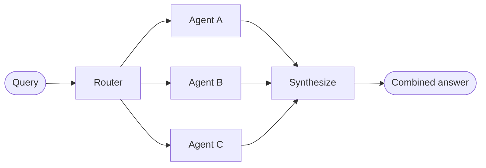

# Router

In the **router** architecture, a routing step classifies input and directs it to specialized agents. This is useful when you have distinct **verticals** (separate knowledge domains that each require their own agent).



## Key characteristics

- Router decomposes the query
- Zero or more specialized agents are invoked in parallel
- Results are synthesized into a coherent response

## When to use

Use the router pattern when you have distinct verticals (separate knowledge domains that each require their own agent), need to query multiple sources in parallel, and want to synthesize results into a combined response.

## Basic implementation

The router classifies the query and directs it to the appropriate agent(s). Use [`Command`](/oss/python/langgraph/graph-api#command) for single-agent routing or [`Send`](/oss/python/langgraph/graph-api#send) for parallel fan-out to multiple agents.

```python
from langgraph.types import Command

def classify_query(query: str) -> str:
    """Use LLM to classify query and determine the appropriate agent."""
    # Classification logic here
    ...

def route_query(state: State) -> Command:
    """Route to the appropriate agent based on query classification."""
    active_agent = classify_query(state["query"])
    return Command(goto=active_agent)
```

For parallel fan-out to multiple agents:

```python
from typing import TypedDict
from langgraph.types import Send

class ClassificationResult(TypedDict):
    query: str
    agent: str

def classify_query(query: str) -> list[ClassificationResult]:
    """Use LLM to classify query and determine which agents to invoke."""
    # Classification logic here
    ...

def route_query(state: State):
    """Route to relevant agents based on query classification."""
    classifications = classify_query(state["query"])
    return [
        Send(c["agent"], {"query": c["query"]})
        for c in classifications
    ]
```

## Stateless vs. stateful

Two approaches:

- **Stateless routers** address each request independently
- **Stateful routers** maintain conversation history across requests

### Stateless

Each request is routed independently—no memory between calls. For multi-turn conversations, see Stateful routers below.

<Tip>
  **Router vs. Subagents**: Both patterns can dispatch work to multiple agents, but they differ in how routing decisions are made:
  - **Router**: A dedicated routing step that classifies the input and dispatches to agents. The router itself typically doesn't maintain conversation history.
  - **Subagents**: A main supervisor agent dynamically decides which subagents to call as part of an ongoing conversation.
</Tip>

### Stateful

For multi-turn conversations, you need to maintain context across invocations.

**Tool wrapper approach**: wrap the stateless router as a tool that a conversational agent can call. The conversational agent handles memory and context; the router stays stateless.

```python
@tool
def search_docs(query: str) -> str:
    """Search across multiple documentation sources."""
    result = workflow.invoke({"query": query})
    return result["final_answer"]

conversational_agent = create_agent(
    model,
    tools=[search_docs],
    prompt="You are a helpful assistant. Use search_docs to answer questions."
)
```

**Full persistence**: If the router needs to maintain state itself, use [persistence](/oss/python/langchain/short-term-memory) to store message history. When routing to an agent, fetch previous messages and selectively include them in the agent's context.

<Warning>
  **Stateful routers require custom history management.** Consider the [handoffs pattern](/oss/python/langchain/multi-agent/handoffs) or [subagents pattern](/oss/python/langchain/multi-agent/subagents) instead—both provide clearer semantics for multi-turn conversations.
</Warning>

***

<div className="source-links">
  <Callout icon="terminal-2">
    [Connect these docs](/use-these-docs) to Claude, VSCode, and more via MCP for real-time answers.
  </Callout>

  <Callout icon="edit">
    [Edit this page on GitHub](https://github.com/langchain-ai/docs/edit/main/src/oss/langchain/multi-agent/router.mdx) or [file an issue](https://github.com/langchain-ai/docs/issues/new/choose).
  </Callout>
</div>