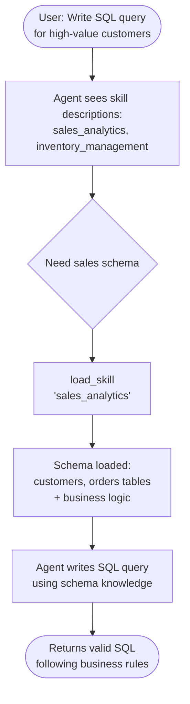

# Build a SQL assistant with on-demand skills

This tutorial shows how to use **progressive disclosure** - a context management technique where the agent loads information on-demand rather than upfront - to implement **skills** (specialized prompt-based instructions).

**Use case:** Imagine building an agent to help write SQL queries across different business verticals in a large enterprise. Your organization might have separate datastores for each vertical, or a single monolithic database with thousands of tables. Either way, loading all schemas upfront would overwhelm the context window.

**What you'll build:** A SQL query assistant with two skills (sales analytics and inventory management). The agent sees lightweight skill descriptions in its system prompt, then loads full database schemas and business logic through tool calls only when relevant to the user's query.

<Tip>
  Progressive disclosure was popularized by Anthropic as a technique for building scalable agent skills systems. See See [Equipping agents for the real world with Agent Skills](https://www.anthropic.com/engineering/equipping-agents-for-the-real-world-with-agent-skills).
</Tip>

## How it works



**Why progressive disclosure:**

- **Reduces context usage** - load only the 2-3 skills needed for a task, not all available skills
- **Enables team autonomy** - different teams can develop specialized skills independently
- **Scales efficiently** - add dozens or hundreds of skills without overwhelming context
- **Simplifies conversation history** - single agent with one conversation thread

## Setup

This tutorial requires the `langchain` package:

```bash
pip install langchain
```

For more details, see our [Installation guide](/oss/python/langchain/install).

## 1. Define skills

First, define the structure for skills. Each skill has a name, a brief description (shown in the system prompt), and full content (loaded on-demand):

```python
from typing import TypedDict

class Skill(TypedDict):
    """A skill that can be progressively disclosed to the agent."""
    name: str
    description: str
    content: str


SKILLS: list[Skill] = [
    {
        "name": "sales_analytics",
        "description": "Database schema and business logic for sales data analysis including customers, orders, and revenue.",
        "content": """# Sales Analytics Schema

## Tables

### customers
- customer_id (PRIMARY KEY)
- name
- email
- signup_date
- status (active/inactive)
- customer_tier (bronze/silver/gold/platinum)

### orders
- order_id (PRIMARY KEY)
- customer_id (FOREIGN KEY -> customers)
- order_date
- status (pending/completed/cancelled/refunded)
- total_amount
- sales_region (north/south/east/west)

## Business Logic

**Active customers**: status = 'active' AND signup_date <= CURRENT_DATE - INTERVAL '90 days'

**Revenue calculation**: Only count orders with status = 'completed'. Use total_amount from orders table, which already accounts for discounts.

**Customer lifetime value (CLV)**: Sum of all completed order amounts for a customer.

**High-value orders**: Orders with total_amount > 1000
""",
    },
    {
        "name": "inventory_management",
        "description": "Database schema and business logic for inventory tracking including products, warehouses, and stock levels.",
        "content": """# Inventory Management Schema

## Tables

### products
- product_id (PRIMARY KEY)
- product_name
- sku
- category
- unit_cost
- reorder_point (minimum stock level before reordering)
- discontinued (boolean)

### warehouses
- warehouse_id (PRIMARY KEY)
- warehouse_name
- location
- capacity

### inventory
- inventory_id (PRIMARY KEY)
- product_id (FOREIGN KEY -> products)
- warehouse_id (FOREIGN KEY -> warehouses)
- quantity_on_hand
- last_updated

## Business Logic

**Available stock**: quantity_on_hand from inventory table where quantity_on_hand > 0

**Products needing reorder**: Products where total quantity_on_hand across all warehouses is less than or equal to the product's reorder_point

**Active products only**: Exclude products where discontinued = true
""",
    },
]
```

## 2. Create skill loading tool

```python
from langchain.tools import tool

@tool
def load_skill(skill_name: str) -> str:
    """Load the full content of a skill into the agent's context.

    Use this when you need detailed information about how to handle a specific
    type of request.
    """
    for skill in SKILLS:
        if skill["name"] == skill_name:
            return f"Loaded skill: {skill_name}\n\n{skill['content']}"

    available = ", ".join(s["name"] for s in SKILLS)
    return f"Skill '{skill_name}' not found. Available skills: {available}"
```

## 3. Build skill middleware

```python
from langchain.agents.middleware import ModelRequest, ModelResponse, AgentMiddleware
from langchain.messages import SystemMessage
from typing import Callable


class SkillMiddleware(AgentMiddleware):
    """Middleware that injects skill descriptions into the system prompt."""

    tools = [load_skill]

    def __init__(self):
        skills_list = []
        for skill in SKILLS:
            skills_list.append(
                f"- **{skill['name']}**: {skill['description']}"
            )
        self.skills_prompt = "\n".join(skills_list)

    def wrap_model_call(
        self,
        request: ModelRequest,
        handler: Callable[[ModelRequest], ModelResponse],
    ) -> ModelResponse:
        skills_addendum = (
            f"\n\n## Available Skills\n\n{self.skills_prompt}\n\n"
            "Use the load_skill tool when you need detailed information."
        )

        new_content = list(request.system_message.content_blocks) + [
            {"type": "text", "text": skills_addendum}
        ]
        new_system_message = SystemMessage(content=new_content)
        modified_request = request.override(system_message=new_system_message)
        return handler(modified_request)
```

## 4. Create the agent

```python
from langchain.agents import create_agent
from langgraph.checkpoint.memory import InMemorySaver

agent = create_agent(
    model,
    system_prompt=(
        "You are a SQL query assistant that helps users "
        "write queries against business databases."
    ),
    middleware=[SkillMiddleware()],
    checkpointer=InMemorySaver(),
)
```

## 5. Test progressive disclosure

```python
from langchain_core.utils.uuid import uuid7

thread_id = str(uuid7())
config = {"configurable": {"thread_id": thread_id}}

result = agent.invoke(
    {
        "messages": [
            {
                "role": "user",
                "content": (
                    "Write a SQL query to find all customers "
                    "who made orders over $1000 in the last month"
                ),
            }
        ]
    },
    config
)

for message in result["messages"]:
    if hasattr(message, 'pretty_print'):
        message.pretty_print()
    else:
        print(f"{message.type}: {message.content}")
```

The agent sees the lightweight skill description in its system prompt, recognizes the question requires sales database knowledge, calls `load_skill("sales_analytics")` to get the full schema and business logic, and then uses that information to write a correct query following the database conventions.

## 6. Advanced: Track loaded skills and enforce tool constraints

You can track which skills have been loaded in custom state and constrain tools to only be available after specific skills have been loaded:

```python
from langchain.agents.middleware import AgentState

class CustomState(AgentState):
    skills_loaded: NotRequired[list[str]]
```

Modify the `load_skill` tool to update state:

```python
from langgraph.types import Command
from langchain.tools import tool, ToolRuntime
from langchain.messages import ToolMessage

@tool
def load_skill(skill_name: str, runtime: ToolRuntime) -> Command:
    """Load the full content of a skill into the agent's context."""
    for skill in SKILLS:
        if skill["name"] == skill_name:
            skill_content = f"Loaded skill: {skill_name}\n\n{skill['content']}"
            return Command(
                update={
                    "messages": [
                        ToolMessage(
                            content=skill_content,
                            tool_call_id=runtime.tool_call_id,
                        )
                    ],
                    "skills_loaded": [skill_name],
                }
            )
    available = ", ".join(s["name"] for s in SKILLS)
    return Command(
        update={
            "messages": [
                ToolMessage(
                    content=f"Skill '{skill_name}' not found. Available skills: {available}",
                    tool_call_id=runtime.tool_call_id,
                )
            ]
        }
    )


@tool
def write_sql_query(
    query: str,
    vertical: str,
    runtime: ToolRuntime,
) -> str:
    """Write and validate a SQL query for a specific business vertical."""
    skills_loaded = runtime.state.get("skills_loaded", [])

    if vertical not in skills_loaded:
        return (
            f"Error: You must load the '{vertical}' skill first "
            f"to understand the database schema before writing queries. "
            f"Use load_skill('{vertical}') to load the schema."
        )

    return (
        f"SQL Query for {vertical}:\n\n"
        f"```sql\n{query}\n```\n\n"
        f"✓ Query validated against {vertical} schema"
    )
```

## Next steps

- Learn about [middleware](/oss/python/langchain/middleware) for more dynamic agent behaviors
- Explore [context engineering](/oss/python/langchain/context-engineering) techniques
- Explore the [handoffs pattern](/oss/python/langchain/multi-agent/handoffs-customer-support)
- Read the [subagents pattern](/oss/python/langchain/multi-agent/subagents-personal-assistant)
- See [multi-agent patterns](/oss/python/langchain/multi-agent)

***

<div className="source-links">
  <Callout icon="terminal-2">
    [Connect these docs](/use-these-docs) to Claude, VSCode, and more via MCP for real-time answers.
  </Callout>

  <Callout icon="edit">
    [Edit this page on GitHub](https://github.com/langchain-ai/docs/edit/main/src/oss/langchain/multi-agent/skills-sql-assistant.mdx) or [file an issue](https://github.com/langchain-ai/docs/issues/new/choose).
  </Callout>
</div>