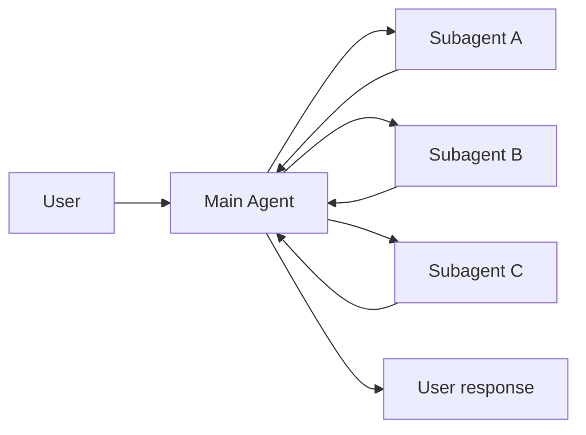
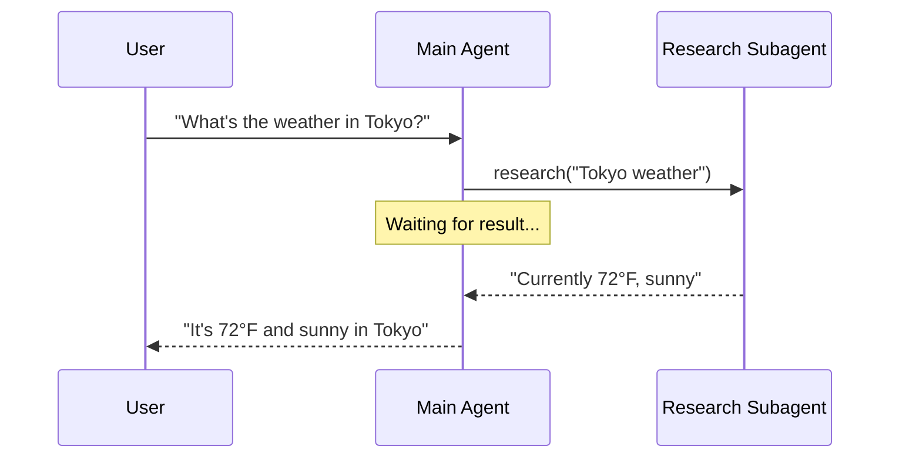
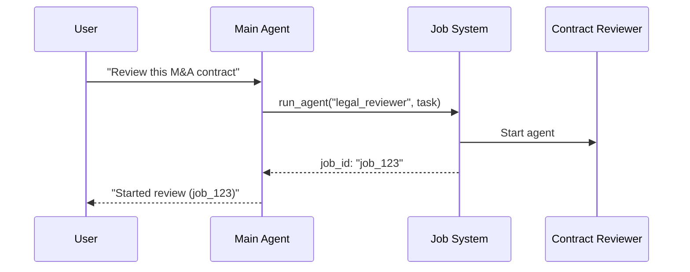

# Subagents

In the **subagents** architecture, a central main agent (often referred to as a **supervisor**) coordinates subagents by calling them as tools. The main agent decides which subagent to invoke, what input to provide, and how to combine results. By default, subagents are stateless—they don't remember past interactions, with all conversation memory maintained by the main agent. This provides context isolation: each subagent invocation works in a clean context window, preventing context bloat in the main conversation.



## Key characteristics

- **Centralized control**: All routing passes through the main agent
- **No direct user interaction**: Subagents return results to the main agent, not the user (though you can use interrupts within a subagent)
- **Subagents via tools**: Subagents are invoked via tools
- **Parallel execution**: The main agent can invoke multiple subagents in a single turn

<Note>
  **Supervisor vs. Router**: A supervisor agent is different from a router. The supervisor is a full agent that maintains conversation context and dynamically decides which subagents to call across multiple turns. A router is typically a single classification step.
</Note>

## When to use

Use the subagents pattern when you have multiple distinct domains (e.g., calendar, email, CRM, database), subagents don't need to converse directly with users, or you want centralized workflow control.

<Tip>
  **Need user interaction within a subagent?** While subagents typically return results to the main agent, you can use [interrupts](/oss/python/langgraph/interrupts#pause-using-interrupt) within a subagent to pause execution and gather user input.
</Tip>

## Basic implementation

The core mechanism wraps a subagent as a tool that the main agent can call:

```python
from langchain.tools import tool
from langchain.agents import create_agent

# Create a subagent
subagent = create_agent(model="google_genai:gemini-3.6-flash", tools=[...])

# Wrap it as a tool
@tool("research", description="Research a topic and return findings")
def call_research_agent(query: str):
    result = subagent.invoke({"messages": [{"role": "user", "content": query}]})
    return result["messages"][-1].content

# Main agent with subagent as a tool
main_agent = create_agent(model="google_genai:gemini-3.6-flash", tools=[call_research_agent])
```

## Design decisions

| Decision                                  | Options                                                                                |
| ----------------------------------------- | -------------------------------------------------------------------------------------- |
| **Sync vs. async**                         | Sync (blocking) vs. async (background)                                                 |
| **Tool patterns**                          | Tool per agent vs. single dispatch tool                                                |
| **Subagent specs**                         | System prompt vs. enum constraint vs. tool-based discovery                              |
| **Subagent inputs**                        | Query only vs. full context                                                            |
| **Subagent outputs**                       | Subagent result vs full conversation history                                           |

## Sync vs. async

Subagent execution can be **synchronous** (blocking) or **asynchronous** (background).

| Mode      | Main agent behavior                         | Best for                               | Tradeoff                            |
| --------- | ------------------------------------------- | -------------------------------------- | ----------------------------------- |
| **Sync**  | Waits for subagent to complete              | Main agent needs result to continue    | Simple, but blocks the conversation |
| **Async** | Continues while subagent runs in background | Independent tasks, user shouldn't wait | Responsive, but more complex        |

### Synchronous (default)



### Asynchronous



The async pattern uses a three-tool pattern: start_job, check_status, get_result.

## Tool patterns

| Pattern                                           | Best for                                                      | Trade-off                                         |
| ------------------------------------------------- | ------------------------------------------------------------- | ------------------------------------------------- |
| **Tool per agent**                                 | Fine-grained control over each subagent's input/output        | More setup, but more customization                |
| **Single dispatch tool**                          | Many agents, distributed teams, convention over configuration | Simpler composition, less per-agent customization |

### Tool per agent

```python
from langchain.tools import tool
from langchain.agents import create_agent

# Create a sub-agent
subagent = create_agent(model="...", tools=[...])

# Wrap it as a tool
@tool("subagent_name", description="subagent_description")
def call_subagent(query: str):
    result = subagent.invoke({"messages": [{"role": "user", "content": query}]})
    return result["messages"][-1].content

# Main agent with subagent as a tool
main_agent = create_agent(model="...", tools=[call_subagent])
```

### Single dispatch tool

Use a single parameterized tool to invoke ephemeral sub-agents for independent tasks:

```python
from langchain.tools import tool
from langchain.agents import create_agent

# Sub-agents developed by different teams
research_agent = create_agent(model="gpt-5.5", prompt="You are a research specialist...")
writer_agent = create_agent(model="gpt-5.5", prompt="You are a writing specialist...")

# Registry of available sub-agents
SUBAGENTS = {
    "research": research_agent,
    "writer": writer_agent,
}

@tool
def task(
    agent_name: str,
    description: str
) -> str:
    """Launch an ephemeral subagent for a task.

    Available agents:
    - research: Research and fact-finding
    - writer: Content creation and editing
    """
    agent = SUBAGENTS[agent_name]
    result = agent.invoke({
        "messages": [
            {"role": "user", "content": description}
        ]
    })
    return result["messages"][-1].content

# Main coordinator agent
main_agent = create_agent(
    model="gpt-5.5",
    tools=[task],
    system_prompt=(
        "You coordinate specialized sub-agents. "
        "Available: research (fact-finding), "
        "writer (content creation). "
        "Use the task tool to delegate work."
    ),
)
```

## Context engineering

Control how context flows between the main agent and its subagents:

- **Subagent specs**: Names and descriptions associated with subagents
- **Subagent inputs**: Customize what context the subagent receives
- **Subagent outputs**: Customize what the main agent receives back

### Subagent inputs

| Mode                   | Subagent receives                                                          | Best for                                     |
| ---------------------- | -------------------------------------------------------------------------- | -------------------------------------------- |
| **Isolated** (default) | Only the task description                                                  | Focused work that needs little prior context |
| **Forked**             | The parent's conversation history (and, in Deep Agents, the system prompt) | Continuing a task the parent already started |

***

<div className="source-links">
  <Callout icon="terminal-2">
    [Connect these docs](/use-these-docs) to Claude, VSCode, and more via MCP for real-time answers.
  </Callout>

  <Callout icon="edit">
    [Edit this page on GitHub](https://github.com/langchain-ai/docs/edit/main/src/oss/langchain/multi-agent/subagents.mdx) or [file an issue](https://github.com/langchain-ai/docs/issues/new/choose).
  </Callout>
</div>