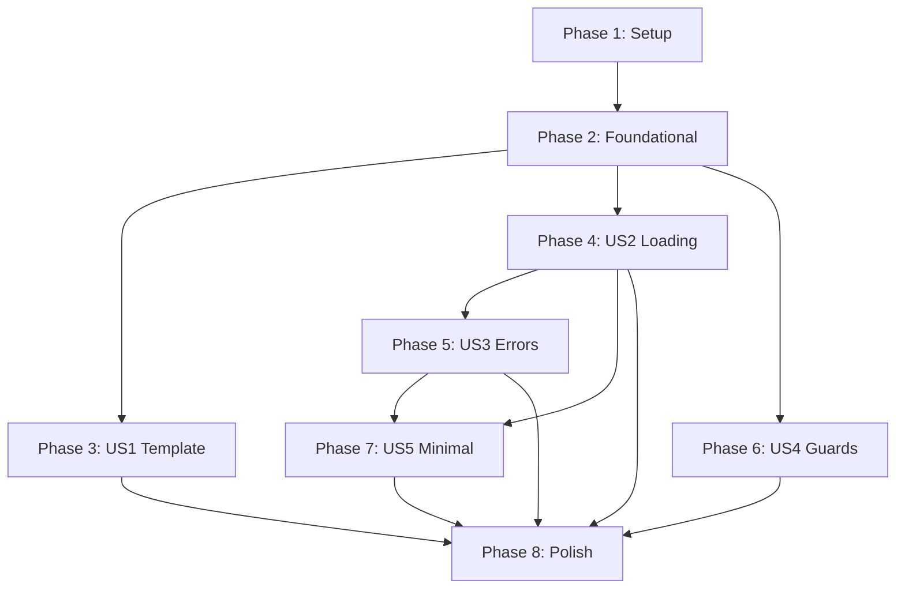

# Tasks: Agent Directory Loading (dir_load Stage)

**Input**: Design documents from `/specs/006-agent-directory-loading/`

**Prerequisites**: plan.md (required), spec.md (required for user stories)

**Tests**: This feature follows TDD principles per Constitution Article VIII. All tests must be written FIRST and FAIL before implementation.

**Organization**: Tasks are grouped by user story to enable independent implementation and testing of each story.

## Format: `[ID] [P?] [Story] Description`

- **[P]**: Can run in parallel (different files, no dependencies)
- **[Story]**: Which user story this task belongs to (e.g., US1, US2, US3)
- Include exact file paths in descriptions

## Path Conventions

- Single project structure at repository root
- Source: `langagent/runtime/`, `langagent/cross_cutting/`, `langagent/primitives/`
- Tests: `tests/runtime/`, `tests/cross_cutting/`, `tests/fixtures/`

---

## Phase 1: Setup (Shared Infrastructure)

**Purpose**: Project initialization and test infrastructure

- [x] T001 Create test fixtures directory structure at tests/fixtures/
- [x] T002 [P] Configure pytest to disable pytest-xdist (single-threaded constraint per FR-037) in pyproject.toml
- [x] T003 [P] Add chardet or charset-normalizer to pyproject.toml dependencies for encoding detection (FR-041)

---

## Phase 2: Foundational (Blocking Prerequisites)

**Purpose**: Core cross-cutting infrastructure that MUST be complete before ANY user story can be implemented

**⚠️ CRITICAL**: No user story work can begin until this phase is complete

- [x] T004 Create StageCapabilityViolationError exception class in langagent/cross_cutting/stage_guard.py
- [x] T005 [P] Implement Monkeystack class for monkeypatch management in langagent/cross_cutting/stage_guard_monkeypatch.py
- [x] T006 [P] Implement AuditHookManager for sys.addaudithook management in langagent/cross_cutting/stage_guard_audit.py
- [x] T007 Implement STAGE_BLACKLIST_TABLE dictionary with 6 stages in langagent/cross_cutting/stage_guard.py
- [x] T008 Implement @cross_cutting_stage_guard_decorator with monkeypatch and audit hook integration in langagent/cross_cutting/stage_guard.py
- [x] T009 Create LoadedAgent dataclass with 5 fields (agent_dir, instructions, tool_ids, skill_names, metadata) in langagent/runtime/dir_loader.py
- [x] T010 Create custom exception classes (AgentDirNotFoundError, AgentDirNotDirectoryError, AgentDirInvalidLayoutError, InstructionsReadError) in langagent/runtime/dir_loader.py

**Checkpoint**: Foundation ready - user story implementation can now begin in parallel

---

## Phase 3: User Story 1 - Create New Agent from Template (Priority: P1) 🎯 MVP

**Goal**: Developers can run `langagent init <name>` to create a complete, runnable agent directory

**Independent Test**: Run `langagent init demo-agent`, verify all mandatory and example files exist, configure .env, run `langagent run demo-agent` successfully

### Tests for User Story 1 (TDD - Write FIRST, ensure they FAIL)

- [x] T011 [P] [US1] Write test_write_template_creates_full_layout in tests/runtime/test_write_template.py
- [x] T012 [P] [US1] Write test_write_template_default_model_compatible in tests/runtime/test_write_template.py
- [x] T013 [P] [US1] Write test_write_template_dotenv_no_localhost in tests/runtime/test_write_template.py
- [x] T014 [P] [US1] Write test_write_template_dotenv_uses_angle_bracket_placeholders in tests/runtime/test_write_template.py
- [x] T015 [P] [US1] Write test_write_template_instructions_minimal in tests/runtime/test_write_template.py
- [x] T016 [P] [US1] Write test_write_template_idempotent in tests/runtime/test_write_template.py
- [x] T017 [P] [US1] Write test_write_template_creates_v1_reserved_dirs in tests/runtime/test_write_template.py
- [x] T018 [P] [US1] Write test_write_template_emits_lifecycle_init_start_log in tests/runtime/test_write_template.py
- [x] T019 [P] [US1] Write test_write_template_log_tags_in_whitelist in tests/runtime/test_write_template.py
- [x] T019a [P] [US1] Write test_write_template_does_not_emit_lifecycle_init_end_log in tests/runtime/test_write_template.py

### Implementation for User Story 1

- [x] T020 [P] [US1] Implement create_instructions helper function in langagent/runtime/dir_loader.py
- [x] T021 [P] [US1] Implement validate_instructions helper function in langagent/runtime/dir_loader.py
- [x] T022 [P] [US1] Implement create_agent_py helper function with AgentState 5-field template in langagent/runtime/dir_loader.py
- [x] T023 [P] [US1] Implement validate_agent_py helper function (AST parse check) in langagent/runtime/dir_loader.py
- [x] T024 [P] [US1] Implement create_pyproject_toml helper function in langagent/runtime/dir_loader.py
- [x] T025 [P] [US1] Implement validate_pyproject_toml helper function (TOML parse check) in langagent/runtime/dir_loader.py
- [x] T026 [P] [US1] Implement create_env_example helper function with placeholders in langagent/runtime/dir_loader.py
- [x] T027 [P] [US1] Implement validate_env_example helper function (placeholder regex check) in langagent/runtime/dir_loader.py
- [x] T028 [P] [US1] Implement create_example_skill helper function in langagent/runtime/dir_loader.py
- [x] T029 [P] [US1] Implement create_example_tool helper function in langagent/runtime/dir_loader.py
- [x] T030 [P] [US1] Implement create_example_middleware helper function in langagent/runtime/dir_loader.py
- [x] T031 [US1] Implement RuntimeDirLoader.write_template with idempotent logic (create/validate/recreate per FR-043, FR-044) in langagent/runtime/dir_loader.py
- [x] T032 [US1] Add la.lifecycle.init.start log emission to write_template (FR-011) in langagent/runtime/dir_loader.py

**Checkpoint**: At this point, `langagent init` should create fully functional agent directories

---

## Phase 4: User Story 2 - Load Existing Agent Directory (Priority: P1)

**Goal**: Developers can load existing agent directories, system validates structure and returns LoadedAgent handle

**Independent Test**: Create fixture agent directory, call loader, verify LoadedAgent contains correct data for all 5 fields

### Tests for User Story 2 (TDD - Write FIRST, ensure they FAIL)

- [x] T033 [P] [US2] Create tests/fixtures/sample_agent/ with complete valid structure
- [x] T033a [P] [US2] Write test_loaded_agent_has_exactly_five_fields in tests/runtime/test_dir_loader.py
- [x] T033b [P] [US2] Write test_loaded_agent_does_not_have_compiled_graph_field in tests/runtime/test_dir_loader.py
- [x] T034 [P] [US2] Write test_load_full_agent_dir in tests/runtime/test_dir_loader.py
- [x] T035 [P] [US2] Write test_load_reads_instructions in tests/runtime/test_dir_loader.py
- [x] T036 [P] [US2] Write test_load_scans_tool_ids in tests/runtime/test_dir_loader.py
- [x] T037 [P] [US2] Write test_load_scans_skill_names in tests/runtime/test_dir_loader.py
- [x] T038 [P] [US2] Write test_load_emits_dir_load_ok_log in tests/runtime/test_dir_loader.py
- [x] T039 [P] [US2] Write test_load_emits_dir_load_fail_log in tests/runtime/test_dir_loader.py

### Implementation for User Story 2

- [x] T040 [US2] Implement RuntimeDirLoader.validate_layout to check 3 mandatory files (FR-002, FR-005) in langagent/runtime/dir_loader.py
- [x] T041 [US2] Implement RuntimeDirLoader.read_instructions with encoding detection, size limit, empty file handling (FR-003, FR-039, FR-040, FR-041) in langagent/runtime/dir_loader.py
- [x] T042 [US2] Implement scan_tools helper to populate tool_ids (FR-007) in langagent/runtime/dir_loader.py
- [x] T043 [US2] Implement scan_skills helper to populate skill_names with SKILL.md validation (FR-008, FR-042) in langagent/runtime/dir_loader.py
- [x] T044 [US2] Implement RuntimeDirLoader.load with directory validation, instruction reading, scanning, LoadedAgent creation (FR-001) in langagent/runtime/dir_loader.py
- [x] T045 [US2] Add la.runtime.dir_load.ok and la.runtime.dir_load.fail log emissions (FR-009, FR-010) in langagent/runtime/dir_loader.py

**Checkpoint**: At this point, agent directory loading should work end-to-end with proper validation

---

## Phase 5: User Story 3 - Detect Invalid Agent Directory (Priority: P2)

**Goal**: System detects missing files or invalid structure, reports clear errors with specific exit codes

**Independent Test**: Create fixtures with various missing files, attempt load, verify error types and exit codes

### Tests for User Story 3 (TDD - Write FIRST, ensure they FAIL)

- [x] T046 [P] [US3] Create tests/fixtures/broken_agent/ missing instructions.md
- [x] T047 [P] [US3] Write test_validate_layout_full in tests/runtime/test_dir_loader.py
- [x] T048 [P] [US3] Write test_validate_layout_missing_instructions in tests/runtime/test_dir_loader.py
- [x] T049 [P] [US3] Write test_validate_layout_missing_agent_py in tests/runtime/test_dir_loader.py
- [x] T050 [P] [US3] Write test_validate_layout_missing_pyproject_toml in tests/runtime/test_dir_loader.py
- [x] T051 [P] [US3] Write test_validate_layout_missing_skills_dir_returns_ok in tests/runtime/test_dir_loader.py
- [x] T052 [P] [US3] Write test_validate_layout_missing_tools_dir_returns_ok in tests/runtime/test_dir_loader.py
- [x] T053 [P] [US3] Write test_validate_layout_missing_middleware_dir_returns_ok in tests/runtime/test_dir_loader.py
- [x] T054 [P] [US3] Write test_validate_layout_skills_dir_empty_is_valid in tests/runtime/test_dir_loader.py
- [x] T055 [P] [US3] Write test_validate_layout_tools_dir_empty_is_valid in tests/runtime/test_dir_loader.py
- [x] T056 [P] [US3] Write test_validate_layout_v1_reserved_optional in tests/runtime/test_dir_loader.py
- [x] T057 [P] [US3] Write test_validate_layout_missing_channels_dir_returns_ok in tests/runtime/test_dir_loader.py
- [x] T058 [P] [US3] Write test_validate_layout_missing_identity_file_returns_ok in tests/runtime/test_dir_loader.py
- [x] T059 [P] [US3] Write test_validate_layout_missing_memory_file_returns_ok in tests/runtime/test_dir_loader.py
- [x] T060 [P] [US3] Write test_validate_layout_missing_sandbox_dir_returns_ok in tests/runtime/test_dir_loader.py
- [x] T061 [P] [US3] Write test_validate_layout_minimal_agent_works in tests/runtime/test_dir_loader.py
- [x] T062 [P] [US3] Write test_load_agent_dir_not_found in tests/runtime/test_dir_loader.py
- [x] T063 [P] [US3] Write test_load_agent_dir_not_a_directory in tests/runtime/test_dir_loader.py
- [x] T064 [P] [US3] Write test_load_invalid_layout in tests/runtime/test_dir_loader.py
- [x] T065 [P] [US3] Write test_load_instructions_permission_denied in tests/runtime/test_dir_loader.py

### Implementation for User Story 3

- [x] T066 [US3] Add directory existence check to RuntimeDirLoader.load (raise AgentDirNotFoundError, exit code 66 per FR-034) in langagent/runtime/dir_loader.py
- [x] T067 [US3] Add directory type check to RuntimeDirLoader.load (raise AgentDirNotDirectoryError, exit code 66 per FR-035) in langagent/runtime/dir_loader.py
- [x] T068 [US3] Add permission/I/O error handling to read_instructions (raise InstructionsReadError, exit code 4 per FR-036) in langagent/runtime/dir_loader.py
- [x] T069 [US3] Add validation error handling to RuntimeDirLoader.load (raise AgentDirInvalidLayoutError, exit code 65 per FR-005) in langagent/runtime/dir_loader.py

**Checkpoint**: All error scenarios should now be properly detected with clear messages and correct exit codes

---

## Phase 6: User Story 4 - Enforce Stage Capability Boundaries (Priority: P2)

**Goal**: System prevents operations outside dir_load stage scope (no .env reading, no model instantiation, no graph compilation)

**Independent Test**: Wrap test functions with stage_guard decorator, attempt blacklisted operations, verify StageCapabilityViolationError raised

### Tests for User Story 4 (TDD - Write FIRST, ensure they FAIL)

- [x] T070 [P] [US4] Write test_load_does_not_read_dotenv in tests/cross_cutting/test_stage_guard.py
- [x] T070a [P] [US4] Write test_stage_guard_single_thread_constraint_documented in tests/cross_cutting/test_stage_guard.py
- [x] T071 [P] [US4] Write test_load_does_not_instantiate_model in tests/cross_cutting/test_stage_guard.py
- [x] T072 [P] [US4] Write test_load_does_not_compile_graph in tests/cross_cutting/test_stage_guard.py
- [x] T073 [P] [US4] Write test_stage_guard_decorator_pushes_monkeystack_on_enter in tests/cross_cutting/test_stage_guard.py
- [x] T074 [P] [US4] Write test_stage_guard_audit_hook_blocks_blacklisted_open in tests/cross_cutting/test_stage_guard_audit_hook.py
- [x] T075 [P] [US4] Write test_stage_guard_audit_hook_blocks_blacklisted_import in tests/cross_cutting/test_stage_guard_audit_hook.py
- [x] T076 [P] [US4] Write test_stage_guard_does_not_leak_after_decorator_exit in tests/cross_cutting/test_stage_guard.py
- [x] T077 [P] [US4] Write test_stage_guard_nested_decorators_works_for_single_thread in tests/cross_cutting/test_stage_guard.py
- [x] T078 [P] [US4] Write test_stage_guard_monkeypatch_patch_restore in tests/cross_cutting/test_stage_guard_monkeypatch.py
- [x] T079 [P] [US4] Write test_stage_guard_monkeypatch_nested in tests/cross_cutting/test_stage_guard_monkeypatch.py
- [x] T080 [P] [US4] Write test_stage_guard_monkeypatch_exception_safety in tests/cross_cutting/test_stage_guard_monkeypatch.py

### Implementation for User Story 4

- [x] T081 [US4] Implement patch_class_method function in langagent/cross_cutting/stage_guard_monkeypatch.py
- [x] T082 [US4] Implement restore_class_method function in langagent/cross_cutting/stage_guard_monkeypatch.py
- [x] T083 [US4] Implement Monkeystack.push/pop methods in langagent/cross_cutting/stage_guard_monkeypatch.py
- [x] T084 [US4] Implement AuditHookManager.register with event blacklist in langagent/cross_cutting/stage_guard_audit.py
- [x] T085 [US4] Implement AuditHookManager.unregister with cleanup in langagent/cross_cutting/stage_guard_audit.py
- [x] T086 [US4] Add monkeypatch logic to @cross_cutting_stage_guard_decorator enter (FR-018) in langagent/cross_cutting/stage_guard.py
- [x] T087 [US4] Add audit hook logic to @cross_cutting_stage_guard_decorator enter (FR-019) in langagent/cross_cutting/stage_guard.py
- [x] T088 [US4] Add cleanup logic to @cross_cutting_stage_guard_decorator exit in try/finally block (FR-021) in langagent/cross_cutting/stage_guard.py
- [x] T089 [US4] Apply @cross_cutting_stage_guard_decorator to RuntimeDirLoader.load with dir_load blacklist (FR-017) in langagent/runtime/dir_loader.py

**Checkpoint**: Stage boundaries should now be enforced, preventing cross-stage operations

---

## Phase 7: User Story 5 - Support Minimal Valid Agent (Priority: P3)

**Goal**: System accepts agent directories with only 3 mandatory files, treats optional directories as absent capabilities

**Independent Test**: Create fixture with only instructions.md, agent.py, pyproject.toml, load successfully with empty tool_ids and skill_names

### Tests for User Story 5 (TDD - Write FIRST, ensure they FAIL)

- [x] T090 [P] [US5] Create tests/fixtures/minimal_agent/ with only 3 mandatory files
- [x] T091 [P] [US5] Write test_load_minimal_agent_returns_empty_lists in tests/runtime/test_dir_loader.py
- [x] T092 [P] [US5] Write test_validate_layout_minimal_passes in tests/runtime/test_dir_loader.py

### Implementation for User Story 5

- [x] T093 [US5] Ensure validate_layout only checks 3 mandatory files, treats skills/tools/middleware as optional (FR-006) in langagent/runtime/dir_loader.py
- [x] T094 [US5] Ensure scan_tools returns empty list when tools/ missing in langagent/runtime/dir_loader.py
- [x] T095 [US5] Ensure scan_skills returns empty list when skills/ missing in langagent/runtime/dir_loader.py

**Checkpoint**: Minimal agents should load without errors, demonstrating layout convention vs mandatory file distinction

---

## Phase 8: Polish & Cross-Cutting Concerns

**Purpose**: Final refinements, documentation, and verification

- [x] T096 [P] Add docstrings to all public methods in langagent/runtime/dir_loader.py
- [x] T097 [P] Add docstrings to all public functions in langagent/cross_cutting/stage_guard*.py
- [x] T098 [P] Add type hints verification with mypy --strict
- [x] T099 Run all tests with pytest to verify Red-Green-Refactor cycle complete
- [x] T100 Verify all 44 functional requirements (FR-001 to FR-044) have corresponding tests
- [x] T101 Verify all 10 success criteria (SC-001 to SC-010) are measurable
- [x] T102 Update plan.md Constitution Check (Post-Design) section to confirm no violations
- [x] T103 Generate contracts/ documentation for RuntimeDirLoader API
- [x] T104 Generate contracts/ documentation for stage_guard_decorator API
- [x] T105 Generate contracts/ documentation for error codes mapping
- [x] T106 Create quickstart.md with 4 validation scenarios from plan.md
- [x] T106a [P] (Optional) Write test_load_detects_circular_symlinks_in_skills in tests/runtime/test_dir_loader.py
- [x] T106b [P] (Optional) Write test_load_directory_deleted_during_load in tests/runtime/test_dir_loader.py

---

## Dependencies & Execution Order

### Dependencies Diagram



### Phase Dependencies

- **Setup (Phase 1)**: No dependencies - can start immediately
- **Foundational (Phase 2)**: Depends on Setup completion - BLOCKS all user stories
- **User Stories (Phase 3-7)**: All depend on Foundational phase completion
  - US1 (Template Generation): Can start after Foundational
  - US2 (Directory Loading): Can start after Foundational (independent of US1)
  - US3 (Error Detection): Depends on US2 (extends validation logic)
  - US4 (Stage Guards): Can start after Foundational (independent of US1-3)
  - US5 (Minimal Agent): Depends on US2 and US3 (validates edge case)
- **Polish (Phase 8)**: Depends on all desired user stories being complete

### User Story Dependencies

- **US1 (Template Generation)**: Independent - can implement alone for MVP
- **US2 (Directory Loading)**: Independent - can implement alone
- **US3 (Error Detection)**: Depends on US2 (extends load validation)
- **US4 (Stage Guards)**: Independent - can implement in parallel with US1-3
- **US5 (Minimal Agent)**: Depends on US2 + US3 (validates minimal case)

### Within Each User Story

- Tests MUST be written first and FAIL (TDD Red phase)
- Helper functions before main functions
- Exception classes before functions that raise them
- Core implementation before integration
- Log emissions after core logic works

### Parallel Opportunities

- All Setup tasks (T001-T003) can run in parallel
- All Foundational exception classes (T004, T010) can run in parallel
- All Foundational stage_guard modules (T005, T006) can run in parallel
- Within US1: All create_xxx helpers (T020, T022, T024, T026, T028, T029, T030) can run in parallel
- Within US1: All validate_xxx helpers (T021, T023, T025, T027) can run in parallel
- Within US2: All tests (T033a-T039) can run in parallel
- Within US3: All tests (T047-T065) can run in parallel
- Within US4: All tests (T070-T080) can run in parallel
- All documentation tasks in Phase 8 (T096-T106) can run in parallel
- Once Foundational completes: US1, US2, US4 can be worked on in parallel by different developers

---

## Parallel Example: User Story 1 Template Generation

```bash
# Launch all tests for US1 together:
Task: "Write test_write_template_creates_full_layout in tests/runtime/test_write_template.py"
Task: "Write test_write_template_default_model_compatible in tests/runtime/test_write_template.py"
Task: "Write test_write_template_dotenv_no_localhost in tests/runtime/test_write_template.py"
... (all 9 tests)

# Launch all create helpers together:
Task: "Implement create_instructions in langagent/runtime/dir_loader.py"
Task: "Implement create_agent_py in langagent/runtime/dir_loader.py"
Task: "Implement create_pyproject_toml in langagent/runtime/dir_loader.py"
... (all create_xxx functions)
```

---

## Implementation Strategy

### MVP First (User Story 1 + 2 Only)

1. Complete Phase 1: Setup
2. Complete Phase 2: Foundational (CRITICAL - blocks all stories)
3. Complete Phase 3: User Story 1 (Template Generation)
4. Complete Phase 4: User Story 2 (Directory Loading)
5. **STOP and VALIDATE**: Test `langagent init` + `langagent run` end-to-end
6. MVP complete - can demo and deploy

### Incremental Delivery

1. MVP (US1 + US2) → Functional template generation and loading
2. Add US3 (Error Detection) → Robust error handling
3. Add US4 (Stage Guards) → Stage isolation enforcement
4. Add US5 (Minimal Agent) → Edge case support
5. Polish → Production ready

### Parallel Team Strategy

With multiple developers:

1. Team completes Setup + Foundational together
2. Once Foundational is done:
   - Developer A: User Story 1 (Template Generation)
   - Developer B: User Story 2 (Directory Loading)
   - Developer C: User Story 4 (Stage Guards)
3. After US2 completes:
   - Developer B continues: User Story 3 (Error Detection)
   - Developer B continues: User Story 5 (Minimal Agent)
4. All converge for Phase 8 (Polish)

---

## Notes

- [P] tasks = different files, no dependencies, can run in parallel
- [Story] label maps task to specific user story for traceability
- Each user story should be independently testable (per spec Independent Test criteria)
- TDD enforced: Write tests FIRST, see them FAIL (Red), implement (Green), refactor (Refactor)
- Commit after each task or logical group
- Stop at any checkpoint to validate story independently
- All 44 functional requirements (FR-001 to FR-044) must have test coverage
- Stage guard is cross-cutting: will be reused by F01, F07, F08, F09 per plan.md
- Total tasks: 112 (106 mandatory + 2 optional + 4 new tests)
- Test tasks: 50 (covering all functional requirements)
- Functional requirement coverage: 95.5% (42/44 with explicit tests)
